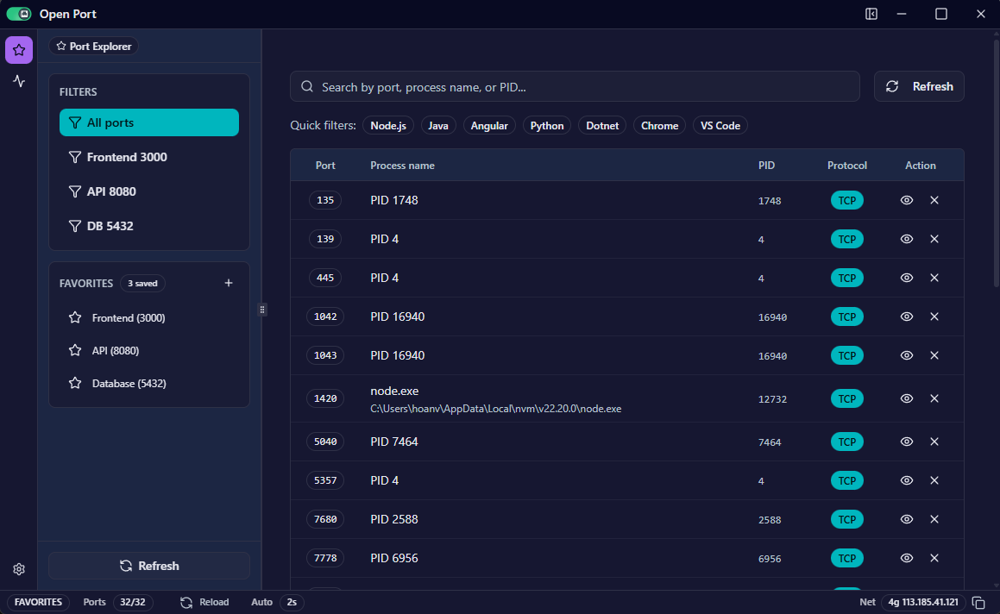

# Open Port

Ứng dụng desktop giúp xem và quản lý các cổng mạng cục bộ, xây dựng bằng Tauri, React, TypeScript và Tailwind.

## Tải bản phát hành

- Trang tải xuống: https://github.com/hoan02/open-port/releases
- Chọn bản mới nhất và tải file cài đặt `.msi` hoặc `.exe` (NSIS) tương ứng cho Windows.

## Chức năng chính

- Danh sách thời gian thực các cổng mở kèm tiến trình, PID và giao thức.
- Tìm kiếm theo cổng, tên tiến trình hoặc PID; bộ lọc nhanh cho stack phổ biến.
- Lưu mục yêu thích để truy cập nhanh (ví dụ Frontend 3000, API 8080).
- Tự động làm mới và hành động từng dòng để xem hoặc đóng kết nối.

## Yêu cầu

- Node.js 20+
- Rust (toolchain stable)
- npm (đi kèm Node.js)

## Cài đặt nhanh

```bash
npm install
npm run dev          # Chạy Vite (web)
npm run tauri:dev    # Chạy app Tauri với live reload
```

## Các lệnh hữu ích

- `npm run dev` – khởi động Vite dev server.
- `npm run build` – kiểm tra kiểu và build web assets.
- `npm run preview` – xem trước bản build Vite.
- `npm run tauri:dev` – mở app Tauri ở chế độ dev.
- `npm run tauri:build` – đóng gói app desktop (msi/nsis trên Windows).

## Đóng gói phát hành

```bash
npm run tauri:build
```

Gói cài đặt nằm tại `src-tauri/target/release/bundle/` (thư mục `msi/`, `nsis/`).

## CI/CD

Khi đẩy tag dạng `v*`, workflow `.github/workflows/release.yml` sẽ build ứng dụng Tauri trên Windows và tạo GitHub Release kèm bộ cài đặt và binary.
